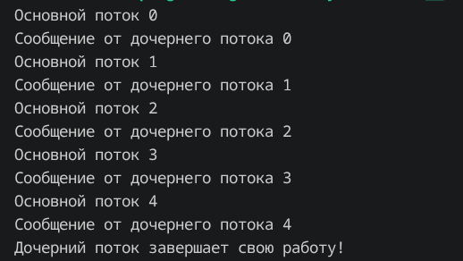
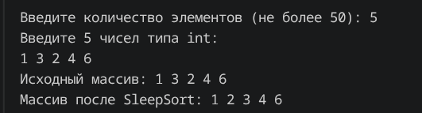
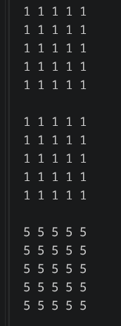
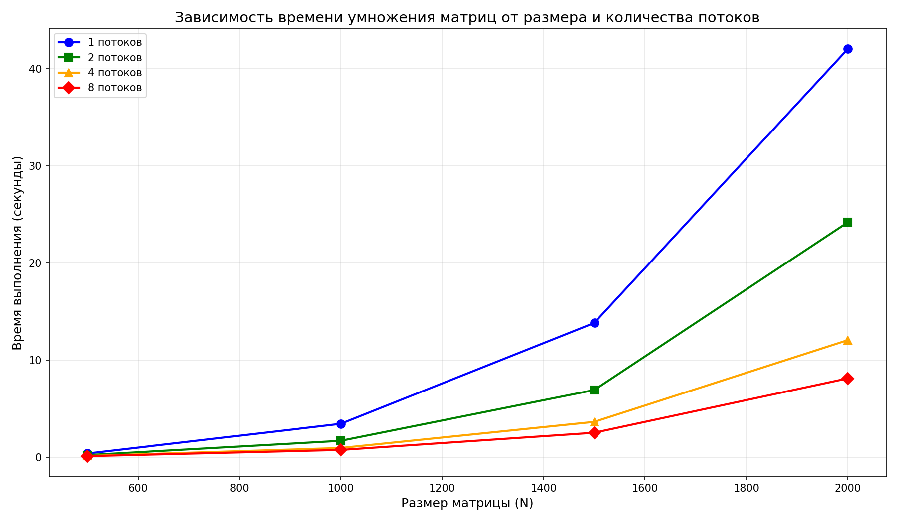

# Потоки (Знакомство с POSIX потоками)

## Отчет по проделанной работе

### Последовательно выводим сообщения от родительского и дочернего потока про помощи мьютексов

### Сортировка SleepSort

### Перемножение матриц

## Результаты измерений

| N (размер матрицы) | 1 поток (с) | 2 потока (с) | 4 потока (с) | 8 потоков (с) |
|:------------------:|:-----------:|:------------:|:------------:|:-------------:|
| 100                | 0.01        | 0.01         | 0.01         | 0.01          |
| 200                | 0.05        | 0.06         | 0.06         | 0.09          |
| 300                | 0.13        | 0.16         | 0.17         | 0.22          |
| 400                | 0.31        | 0.33         | 0.41         | 0.52          |
| 500                | 0.60        | 0.62         | 0.68         | 0.94          |

## На графике видно, что с увеличением числа потоков время работы программы уменьшается