# Оценка 3

## 1-4

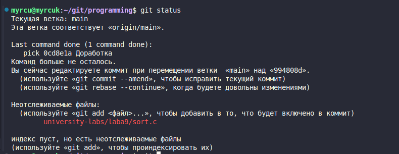
- с помощью git log мы получаем историю коммитов репозитория programming
- после того как я добавил файл sort.c он начал отображаться в git status как не отслеживаемый

## 5-8

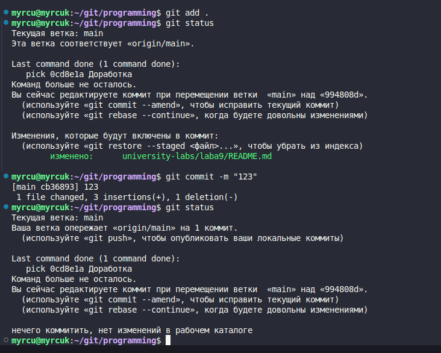
- после добавления файлов в stage git status укказывает на те файлы которые попадут в следующий коммит
- после того как мы закоммитили в git statuse показывает что нам нечего коммитить и можно пушить

## 9-12

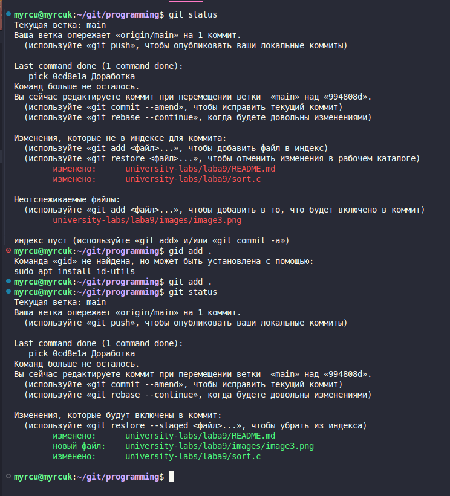
- комментарий будет добавлен в индекс (staging area) для следующего коммита.
- после добавления появляется перечень файлов которые будут в следующем коммите

## 13-17

- в git status теперь показывает непроиндесированные изменения (второй комментарий в sort.c) и то что ветка main опережает origin/main на 2 коммита

# Ветки

## 1-5

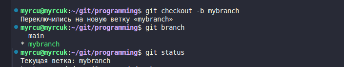
- команда git checkout -b создает новую ветку и переключается на нее, а git status и git branch показывают нам что мы находимся на ветке mybranch

## 6-10

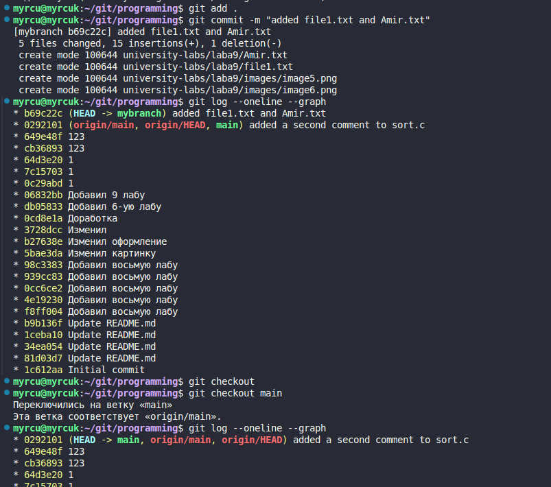
- находясь на нашей новой метке git log показывает нам коммит на этой ветке и то что мы находимся на ней
- после того как мы вернулись на ветку main мы перестаем видеть нашу созданную ветку mybranch

## 11-14

- наш файл file2.txt не удаляется а остается в ветке master

## 15-17
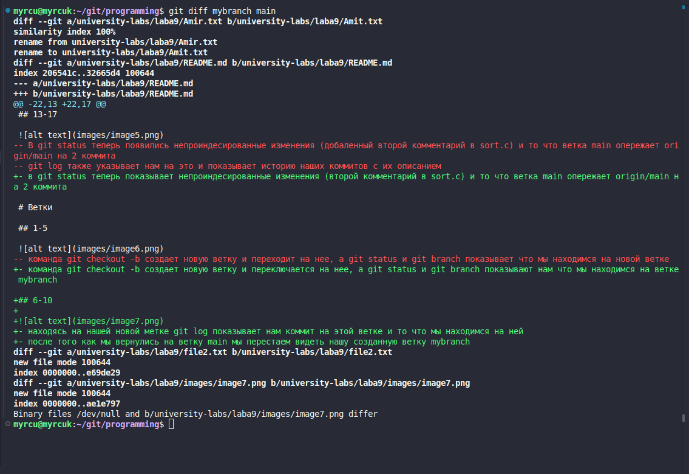
- git diff показал разницу между двумя ветками

# Оценка 4

## 1-4

- git diff --staged пустой тк в стедже ничего нет
- git diff показывает изменения в файле

## 5-7

- после использования команды git diff мы ничего не видим,а git diff --staged указывает на проиндексированные изменения которые до этого были в git diff

## 8-11
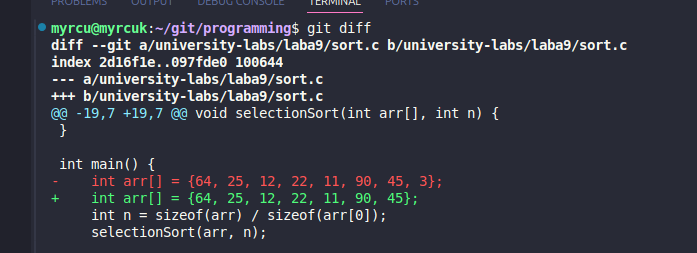
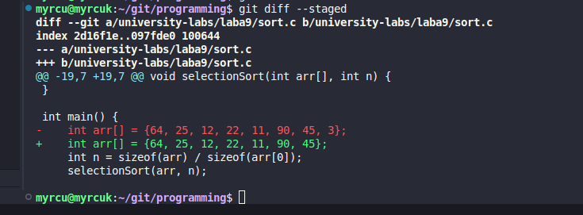
- git diff указывает на отличия между проиндексированным и непроиндексированными файлами
- после добавления в stage команда git diff --stage также показывает нам различия

## 12-14
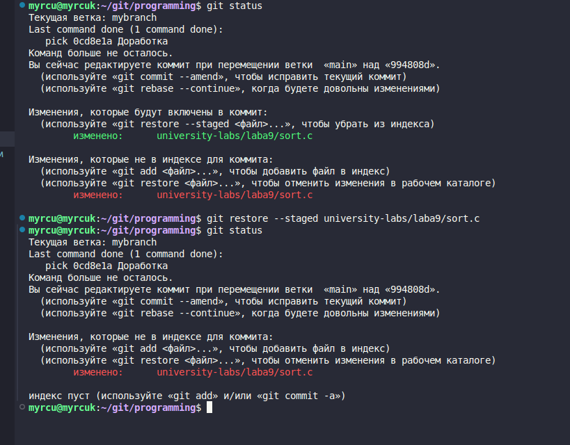
- сначала в git status мы видим проиндексированные изменения и непроиндексированые, но после отмены индексации мы видим только непроиндексированные

## 15-16

- появился только что сделанный нами коммит

## 17-19
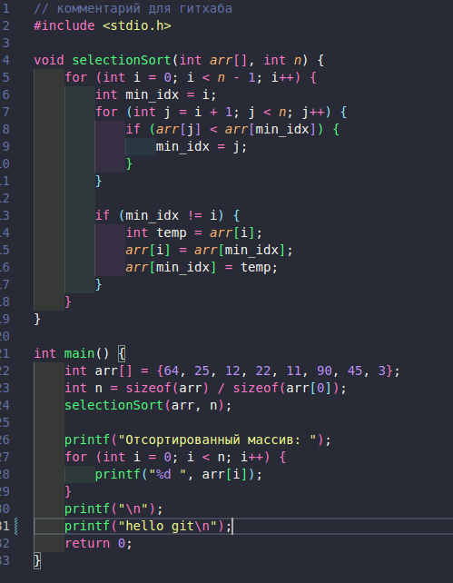
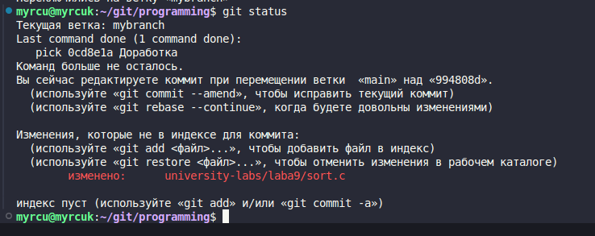
- добавил в файл sort.c print("hello git\n");
- git status показывает нам непроиндексированные изменения

## 20-23

- после использования git restore файл sort.c вернулся до состояния добавления printf("hello git\n");
- git status говорит об отсутсвии изменений

# Ветки и ff-merge

## 1-5

- создал новый файл по заданию и добавил туда строку hello
- создал новую ветку и перешел в нее, с помощью git status видим что нет изменений

## 6-9
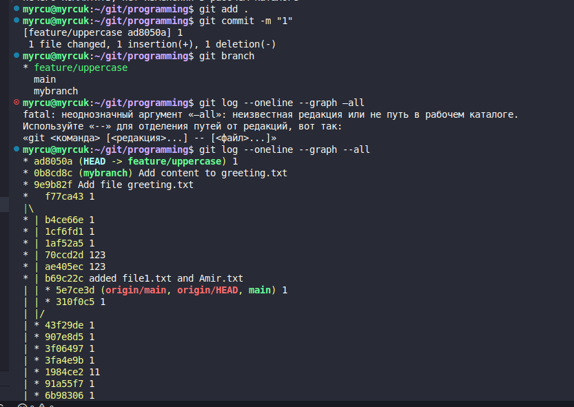
- git branch показывает нам все ветки и выдялет ту на которой мы находимся
- git log --oneline --graph --all выводит все наше дерево коммитов 

## 10-12
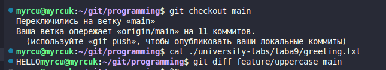

- cat в ветке main выводит HELLO, а git diff показывает разницу написания  hello/HELLO в зависимости от ветки

## 13-19
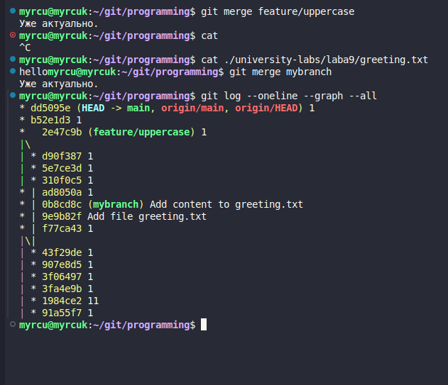
